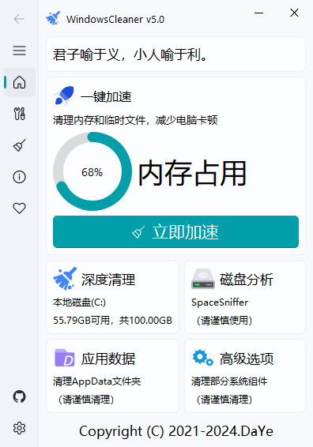
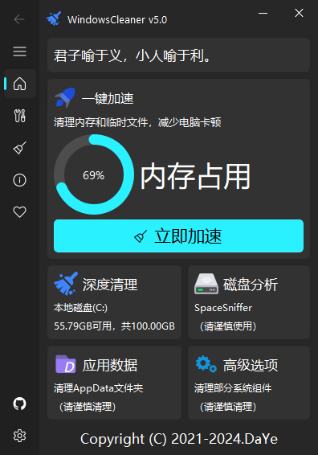

<div align=center>


<h1>Windows Cleaner</h1>


<h3>专治C盘爆红及各种不服！</h3>
</div>

> [!warning]
>
> 安装软件时请先关闭杀毒软件(如Windows Defender)，否则会被误杀！
> 并以管理员身份运行WindowsCleaner！

> [!warning]
>
> 本项目从未发布至 GitCode，如您发现请截图并保留证据

## 🎨 运行截图 GUI
|  |  |
|:----------------------:|:----------------------:|

## 🖥 支持的操作系统

- Windows 10,11

<details>
<summary>
使用方法 How to use
</summary>

### 下载安装包📦

[Windows Cleaner官网：https://wc.dyblog.online](https://wc.dyblog.online)

从[夸克网盘](https://pan.quark.cn/s/03e706cb753a)下载Windows Cleaner(amd64)的安装包。

或从[蓝奏云网盘](https://wwt.lanzn.com/b03xje5uf)下载Windows Cleaner(amd64)的安装包。

密码:4ar1

### 安装
一路Next即可，如果想以后方便打开可以勾选上`创建桌面快捷方式`选项。
</details>

## 💻 从源代码构建 How to build
### 源码运行
- 克隆此仓库
- 安装 Python 3.8
- 安装依赖`pip install -r requirements.txt`
- 运行`python main.py`
### 本地编译
- 先完成源码运行
- 安装 Visual Studio 以及 msvc 编译器
- 安装 Nuitka
```pip
pip install nuitka
```
- 编译
```python
python -m nuitka --standalone --windows-uac-admin --remove-output --windows-console-mode=“disable” --enable-plugins=“pyqt5” --output-dir=“dist” --main=“wincleaner.py” --windows-icon-from-ico=“icon.ico”
```
> [!tip]
>
> 如果您的电脑未安装 Visual Studio 以及 msvc 编译器，Nuitka 会直接从 Github 下载 Mingw64，不论电脑上是否安装 Mingw64！

### 编译安装包
1. 电脑安装 Inno Setup
2. 使用 Inno Setup 打开`scipt.iss`，点击编译即可
3. 生成的安装程序在`releases`目录下

- 将`WCMain`文件夹复制到`dist\main.dist`下，运行`main.exe`即可
#### GitHub Actions（推荐）
- 全自动编译，直接运行（或勾选“生成安装包”生成安装程序），运行结束后下载编译产物全部解压即可使用(注：编译时间非常长，大概编译一次需要20-30分钟）/或下载带`Setup`字样的压缩包，解压后运行安装程序安装即可

## 📝未来计划 Future Ideas

- [x] 增加内存优化功能
- [ ] 完善高级清理功能
- [ ] 支持更多语言
- [x] 更换UI字体
- [x] 修复开机自启Bug

## 🎖 贡献者 Contributors

<a href="https://github.com/darkmatter2048/WindowsCleaner/graphs/contributors">
  
</a>

## 🤝支持 Windows Cleaner的开发

[](https://dyblog.online/donate)

## ⭐ 星标历史 Star History

<a href="https://star-history.com/#darkmatter2048/WindowsCleaner&Date">
 <picture>
   <source media="(prefers-color-scheme: dark)" srcset="https://api.star-history.com/svg?repos=darkmatter2048/WindowsCleaner&type=Date&theme=dark" />
   <source media="(prefers-color-scheme: light)" srcset="https://api.star-history.com/svg?repos=darkmatter2048/WindowsCleaner&type=Date" />
   
 </picture>
</a>

## 鸣谢

- 🚀特别鸣谢[TC999](https://github.com/TC999)(编写GA编译脚本，解决UAC问题，开发日志功能)

- 🥳所有[DaYe](https://dyblog.online/)开源事业的支持者

- [PyQt5](https://www.qt.io/)

- [QFluentWidgets](https://qfluentwidgets.com/)(基于PyQt5的UI框架)


## Copyright & License ⚖

Copyright © 2021-2025.DaYe

[Windows Cleaner](https://wc.dyblog.online/) by [DaYe](https://dyblog.online/) is licensed under [GPL-3.0](LICENSE).

> [!warning]
>
> ### 重要补充声明
>
> 本项目的核心价值在于深度清理算法[clean.py](clean.py)，为保护知识产权与贡献者权益，特此声明：
>
> **任何功能等效的实现（无论使用何种编程语言、框架或技术），若实质性地复制或衍生自本算法设计的逻辑结构、数据处理流程或优化方案，均视为 GPL-3.0 定义的衍生作品，须遵守 GPL-3.0 开源义务。**
