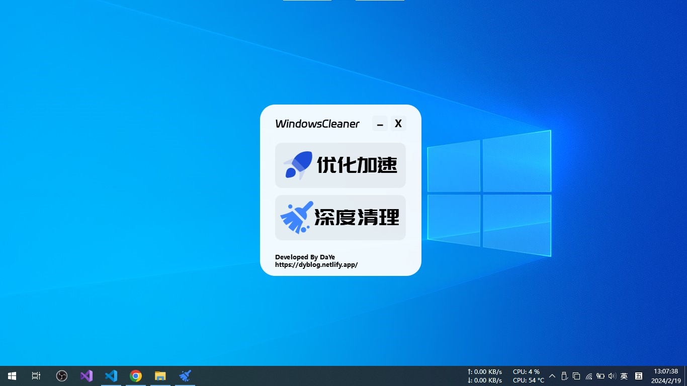

# Windows Cleaner——专治C盘爆红及各种不服！
## 🎨运行截图 GUI

## 🖥系统要求 System Requirements

- Windows操作系统：Windows 10 或以上
- Windows: Windows 10 or above

## 使用方法

### 下载安装包

从[蓝奏云网盘](https://wwt.lanzn.com/b03xje5uf)下载Windows Cleaner(amd64)的安装包。

密码:4ar1

### 安装
一路Next即可，如果想以后方便打开可以勾选上`创建桌面快捷方式`选项。

### 从源代码构建

- Python 3.8

## Star History

[Bilibili:阳刚の少年](https://space.bilibili.com/1847808902?spm_id_from=333.1007.0.0)

## 🤝致谢 Gratitude

