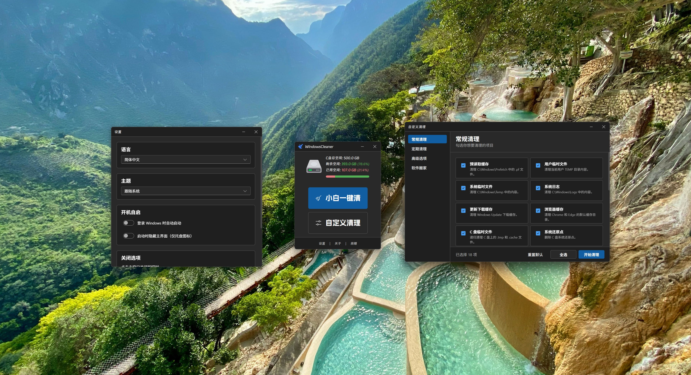

> [!IMPORTANT]  
> 
> ### 🥳 作者开发的多功能图片工具箱[PhotoStudio 3](https://dps.dyblog.online/)正式上线啦！

<h1>Windows Cleaner</h1>

> [!CAUTION]  
> 
> #### 🔔 如有一般性问题请前往[Discussions](https://github.com/darkmatter2048/WindowsCleaner/discussions)讨论区，***Issues* 仅用于错误报告和功能请求。**

> [!tip]
>
> #### 🪜🧱 从[中国大陆地区](https://pan.quark.cn/s/03e706cb753a)下载最新版Windows Cleaner

## 主界面

## 贡献者

## 鸣谢

我真的很感谢所有支持我在GitHub上的开源工作的优秀人士和企业。

<table>
  <tr>
    <td>
      
    </td>
    <td>
    Free code signing on Windows provided by <a href="https://signpath.io">SignPath.io</a>, certficate by <a href="https://signpath.org/">SignPath Foundation</a>
    </td>
  </tr>
  <tr>
    <td>
      
    </td>
    <td>
    非常感谢<a href="https://www.qiaoxh.com/?from=dyblog.online">乔星欢</a>为dyblog.online提供的免费的CDN服务(<a href="https://www.devpole.com/?from=dyblog.online">DevPole</a>)❤️
    </td>
  </tr>
  <tr>
    <td>
      
    </td>
    <td>
    感谢<a href="https://space.bilibili.com/67079745?from=dyblog.online">玄离199</a>的安利，很意外，也很惊喜🥳<a href="https://www.bilibili.com/video/BV1VmLozrEDE">视频地址</a>
    </td>
    </td>
  </tr>
  <tr>
    <td>
      
    </td>
    <td>
    感谢<a href="https://space.bilibili.com/175870152?from=dyblog.online">资源汇社区</a>的安利🥳<a href="https://www.bilibili.com/video/BV1h3gh6aEbJ">视频地址</a>
    </td>
  </tr>
</table>

## 收藏数

<a href="https://www.star-history.com/?repos=darkmatter2048%2FWindowsCleaner&type=date&legend=top-left">
 <picture>
   <source media="(prefers-color-scheme: dark)" srcset="https://api.star-history.com/chart?repos=darkmatter2048/WindowsCleaner&type=date&theme=dark&legend=top-left&sealed_token=YcP5zIRg5ZbiDQmF65kGhWYS5iUR_r3kx8GxNaYJ6HX0VEVwn4OyDtxCJQN47Ud4Eu3hLxBZmP2_o2d0nIfz3DWvZAKa8gndcZdF7PuYkila75c64JlkCg" />
   <source media="(prefers-color-scheme: light)" srcset="https://api.star-history.com/chart?repos=darkmatter2048/WindowsCleaner&type=date&legend=top-left&sealed_token=YcP5zIRg5ZbiDQmF65kGhWYS5iUR_r3kx8GxNaYJ6HX0VEVwn4OyDtxCJQN47Ud4Eu3hLxBZmP2_o2d0nIfz3DWvZAKa8gndcZdF7PuYkila75c64JlkCg" />
   
 </picture>
</a>

## 友情推广

DaYe的朋友们的主页

<table>
  <tr>
    <td>
      
    </td>
    <td>
    <a href="https://space.bilibili.com/501149848?from=dyblog.online">星之墨辰</a>——互联网中的全能区UP，乃究极宝藏！关注他，你能得到不一样的惊喜！ 合作微信：ZHAO15943546500 粉丝群：149054683</a>
    </td>
  </tr>
  <tr>
    <td>
      
    </td>
    <td>
    <a href="https://space.bilibili.com/648765401">陈生杂物房</a>——WindowsCleaner老版本贡献者之一，佛系UP，随缘更新，外语日本语
    </td>
  </tr>
  <tr>
    <td>
      
    </td>
    <td>
    <a href="https://www.sakuraxy.top/?from=dyblog.online">玄夜の资源站</a>：专心做好一件事——做最好的资源站
    </td>
  </tr>
  <tr>
    <td>
      
    </td>
    <td>
    <a href="https://lcgf.xyz/?from=dyblog.online">蓝创工坊OPC</a>：记录探索如何激发创新，创新如何产生价值，价值如何上升艺术
    </td>
  </tr>
  <tr>
    <td>
      
    </td>
    <td>
    <a href="https://space.bilibili.com/297566799?from=dyblog.online">一只莫欣儿</a>：我恨人类！！！！一只莫欣儿，成分：开发者、乐子人、动画师、废物</a>
    </td>
  </tr>
  <tr>
    <td>
      
    </td>
    <td>
    <a href="https://vladelaina.com/">vladelaina</a>：信仰开源之道，崇尚 Arch 之美，沉溺二次元世界
    </td>
  </tr>
  <tr>
    <td>
      
    </td>
    <td>
    <a href="https://github.com/Necream">Necream</a>：复刻并尝试二创WindowsCleaner
    </td>
  </tr>
</table>

## Copyright & License ⚖

Copyright © 2021-2026.DaYe

<a property="dct:title" rel="cc:attributionURL" href=#>WindowsCleaner</a> by <a rel="cc:attributionURL dct:creator" property="cc:attributionName" href="https://www.dyblog.online/">DaYe</a> is licensed under <a href="https://creativecommons.org/licenses/by-nc-sa/4.0/?ref=chooser-v1" target="_blank" rel="license noopener noreferrer" style="display:inline-block;">CC BY-NC-SA 4.0</a>

